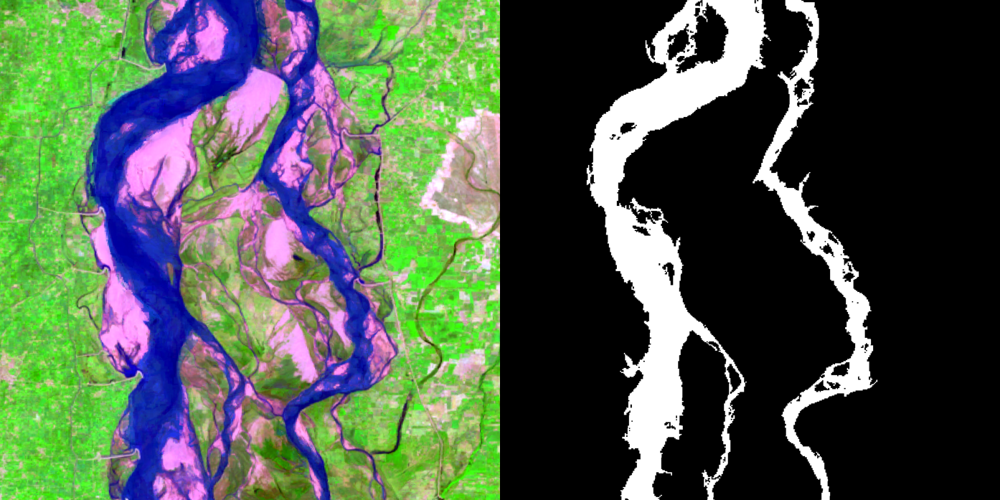

# GEE_watermasks
GEE_watermasks is a software package to download Google Earth Engine data and generate client-side binary masks of river location.



## Dependencies
* Python version=3.10
* GDAL (can be installed via conda)
* shapely (tested on 1.7.1 )
* earthengine-api 
* geemap 
* numpy
* rasterio
* pyproj 
* fiona 
* scikit-image 
* geopandas 

Dependencies other than GDAL can be installed using the Python Package Installer (pip):

```
pip install -r requirements.txt 
```

## Running Puller

The puller is run from shell and python scripts found in the /scripts directory. These scripts include the parameters used to determine what you pull and how you want to generate the masks

Parameters include:

* river - name of the study area/river (also used as name for file storage and file names)
* poly - path to the .gpkg file used to determine the region of interest. Examples of these can be found in the /examples directory
* mask_method - method to generate water masks (options include Jones, ESA
* dataset= - if Jones or Zou are selected, this dtermines if you pull Landsat or Sentinel-2 data
* network_method - determines how the water mask is reduced to a river mask (options are grwl, merit, largest, or all). The merit option requires an additional local file
* network_path - (optional) path to the merit path used for hydroshed river network reductions (good for small rivers)
* images - true/false flag to tell program to pull images
* masks - true/false flag to tell program to generate masks
* water_level - (only needed if Jones is the mask method) tells which water level the program will use as the threshold
* start - Month-day to use as the beginning period for compositing
* end - Month-day to use as the ending period for compositing
* start_year - First year to run
* end_year - Last year to run (program will run all years in between start and end)
* out - root to export all images and masks to

Example:
river='Indus'\
poly="/Shapes/$river.gpkg"\
mask_method="Jones"\
dataset='landsat'\
network_method="grwl"\
images="true"\
masks="true"\
water_level="2"\
start="01-01"\
end="12-31"\
start_year="2021"\
end_year="2021"\
out="Figures/Indus"
